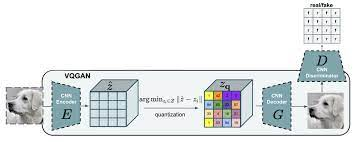
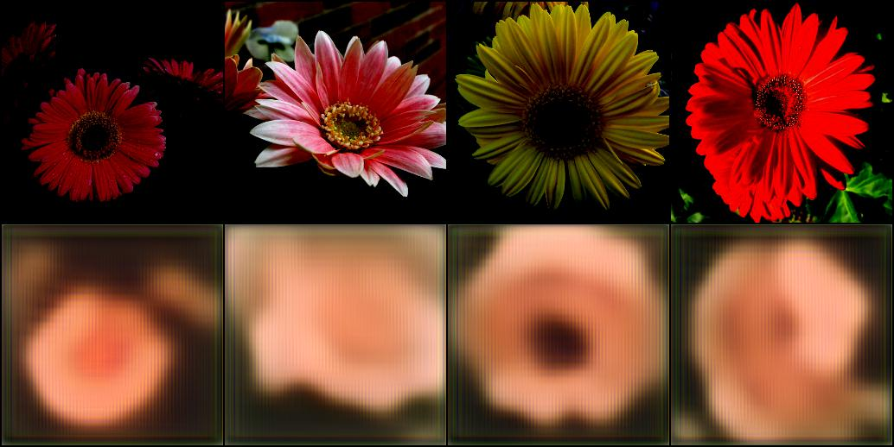
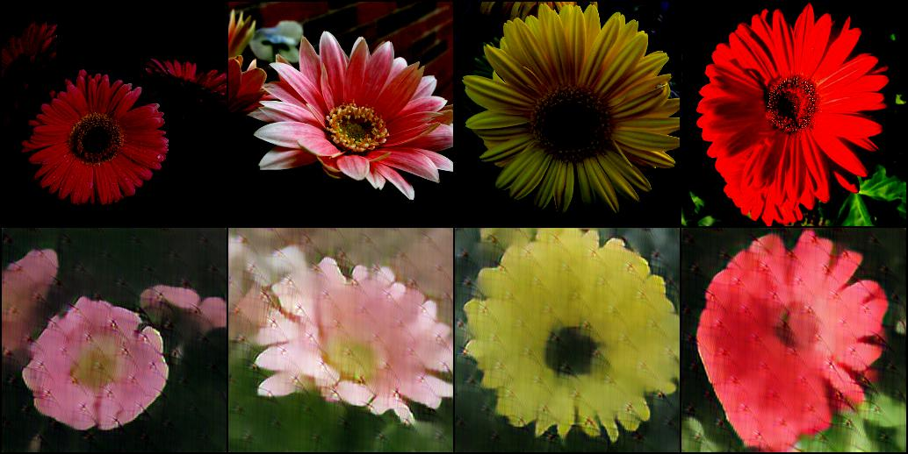

<!-- Improved compatibility of back to top link: See: https://github.com/Killua7362/vqgan/pull/73 -->
<a name="readme-top"></a>
<!--
*** Thanks for checking out the Best-README-Template. If you have a suggestion
*** that would make this better, please fork the repo and create a pull request
*** or simply open an issue with the tag "enhancement".
*** Don't forget to give the project a star!
*** Thanks again! Now go create something AMAZING! :D
-->


<!-- PROJECT SHIELDS -->
<!--
*** I'm using markdown "reference style" links for readability.
*** Reference links are enclosed in brackets [ ] instead of parentheses ( ).
*** See the bottom of this document for the declaration of the reference variables
*** for contributors-url, forks-url, etc. This is an optional, concise syntax you may use.
*** https://www.markdownguide.org/basic-syntax/#reference-style-links
-->
[![Contributors][contributors-shield]][contributors-url]
[![Forks][forks-shield]][forks-url]
[![Stargazers][stars-shield]][stars-url]
[![Issues][issues-shield]][issues-url]
[![MIT License][license-shield]][license-url]
[![LinkedIn][linkedin-shield]][linkedin-url]


<!-- PROJECT LOGO -->
<br />
<div align="center">
  <a href="https://github.com/Killua7362/vqgan">
    
  </a>

  <h3 align="center">VQGAWN</h3>

  <p align="center">
    VQGAN implementation from scratch using pytorch!<br>
    <a href="https://github.com/Killua7362/vqgan/issues">Report Bug</a>
    ·
    <a href="https://github.com/Killua7362/vqgan/issues">Request Feature</a>
  </p>
</div>


<!-- TABLE OF CONTENTS -->
<details>
  <summary>Table of Contents</summary>
  <ol>
    <li>
      <a href="#about-the-project">About The Project</a>
    </li>
    <li>        
    <a href="#built-with">Built With</a>
    </li>
    <li>
      <a href="#getting-started">Getting Started</a>
    </li>
      <li>
      <a href="#results">Results</a>
    </li>
    <li><a href="#roadmap">Roadmap</a></li>
        <li><a href="#credits">Credits</a></li>

  </ol>
</details>


<!-- ABOUT THE PROJECT -->
## About The Project
VQGAN, short for Vector Quantized Generative Adversarial Network, is a powerful deep learning architecture used in the field of image generation. It combines elements of both generative adversarial networks (GANs) and vector quantization to create high-quality, diverse, and controllable images. VQGAN utilizes a discrete latent space to represent image features, allowing for efficient and expressive encoding of visual information.


### Built With

* [Python](https://www.python.org/)
*  [Pytorch](https://pytorch.org/)
* [numpy](https://numpy.org/)


<!-- GETTING STARTED -->
## Getting Started

Install all the libraries
  ```sh
  pip install pytorch tqdm numpy albumentations matplotlib
  ```

Change the arguments value like dataset,batch size,etc in `training_vqgan.py` file and run that file 

<!-- Results -->
## Results

### 0 Epochs


### 100 Epochs



<!-- ROADMAP -->
## Roadmap
- [x] Implementing 1st phase of the paper
- [ ] Implementing transformer architecture for 2nd phase
- [ ] Adding another vqgan model with prompt or masked images

See the [open issues](https://github.com/Killua7362/vqgan/issues) for a full list of proposed features (and known issues).


<!-- Credits -->
## Credits
- https://www.youtube.com/@outliier
- https://arxiv.org/abs/2012.09841

## Citation
```bibtex
@misc{esser2021taming,
      title={Taming Transformers for High-Resolution Image Synthesis}, 
      author={Patrick Esser and Robin Rombach and Björn Ommer},
      year={2021},
      eprint={2012.09841},
      archivePrefix={arXiv},
      primaryClass={cs.CV}
}
```

<!-- MARKDOWN LINKS & IMAGES -->
<!-- https://www.markdownguide.org/basic-syntax/#reference-style-links -->
[contributors-shield]: https://img.shields.io/github/contributors/Killua7362/vqgan.svg?style=for-the-badge
[contributors-url]: https://github.com/Killua7362/vqgan/graphs/contributors
[forks-shield]: https://img.shields.io/github/forks/Killua7362/vqgan.svg?style=for-the-badge
[forks-url]: https://github.com/Killua7362/vqgan/network/members
[stars-shield]: https://img.shields.io/github/stars/Killua7362/vqgan.svg?style=for-the-badge
[stars-url]: https://github.com/Killua7362/vqgan/stargazers
[issues-shield]: https://img.shields.io/github/issues/Killua7362/vqgan.svg?style=for-the-badge
[issues-url]: https://github.com/Killua7362/vqgan/issues
[license-shield]: https://img.shields.io/github/license/Killua7362/vqgan.svg?style=for-the-badge
[license-url]: https://github.com/Killua7362/vqgan/blob/master/LICENSE.txt
[linkedin-shield]: https://img.shields.io/badge/-LinkedIn-black.svg?style=for-the-badge&logo=linkedin&colorB=555
[linkedin-url]: https://linkedin.com/in/Killua7362
[product-screenshot]: images/screenshot.png
[Next.js]: https://img.shields.io/badge/next.js-000000?style=for-the-badge&logo=nextdotjs&logoColor=white
[Next-url]: https://nextjs.org/
[React.js]: https://img.shields.io/badge/React-20232A?style=for-the-badge&logo=react&logoColor=61DAFB
[React-url]: https://reactjs.org/
[Vue.js]: https://img.shields.io/badge/Vue.js-35495E?style=for-the-badge&logo=vuedotjs&logoColor=4FC08D
[Vue-url]: https://vuejs.org/
[Angular.io]: https://img.shields.io/badge/Angular-DD0031?style=for-the-badge&logo=angular&logoColor=white
[Angular-url]: https://angular.io/
[Svelte.dev]: https://img.shields.io/badge/Svelte-4A4A55?style=for-the-badge&logo=svelte&logoColor=FF3E00
[Svelte-url]: https://svelte.dev/
[Laravel.com]: https://img.shields.io/badge/Laravel-FF2D20?style=for-the-badge&logo=laravel&logoColor=white
[Laravel-url]: https://laravel.com
[Bootstrap.com]: https://img.shields.io/badge/Bootstrap-563D7C?style=for-the-badge&logo=bootstrap&logoColor=white
[Bootstrap-url]: https://getbootstrap.com
[JQuery.com]: https://img.shields.io/badge/jQuery-0769AD?style=for-the-badge&logo=jquery&logoColor=white
[JQuery-url]: https://jquery.com 
[Chakra.com]: https://raw.githubusercontent.com/chakra-ui/chakra-ui/main/media/logo-colored@2x.png?raw=true
[Chakra-url]: https://chakra-ui.com/
[Express-url]:https://expressjs.com/
[NodeJS-url]:https://nextjs.org/
[MDX-url]:https://mdxjs.com/
[next-mdx-url]:https://github.com/hashicorp/next-mdx-remote/
